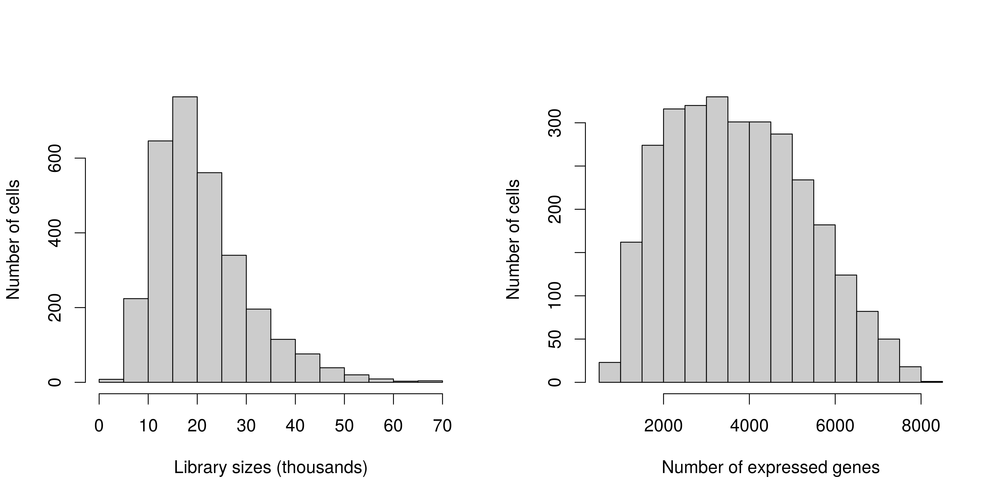
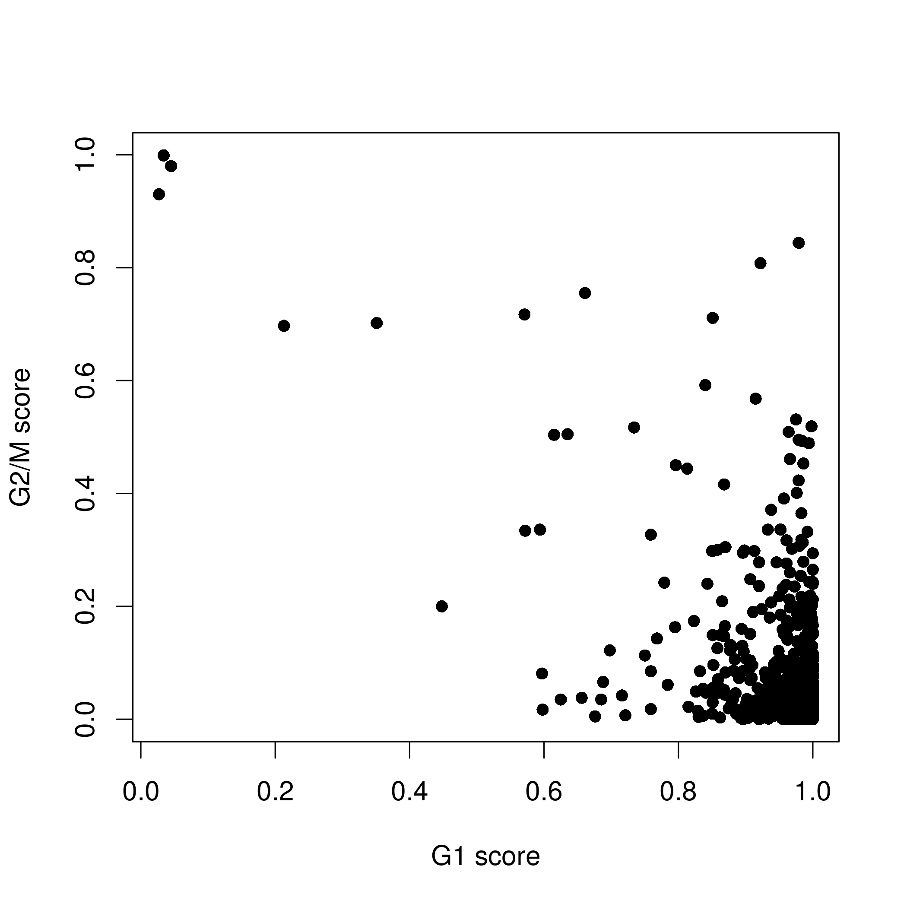
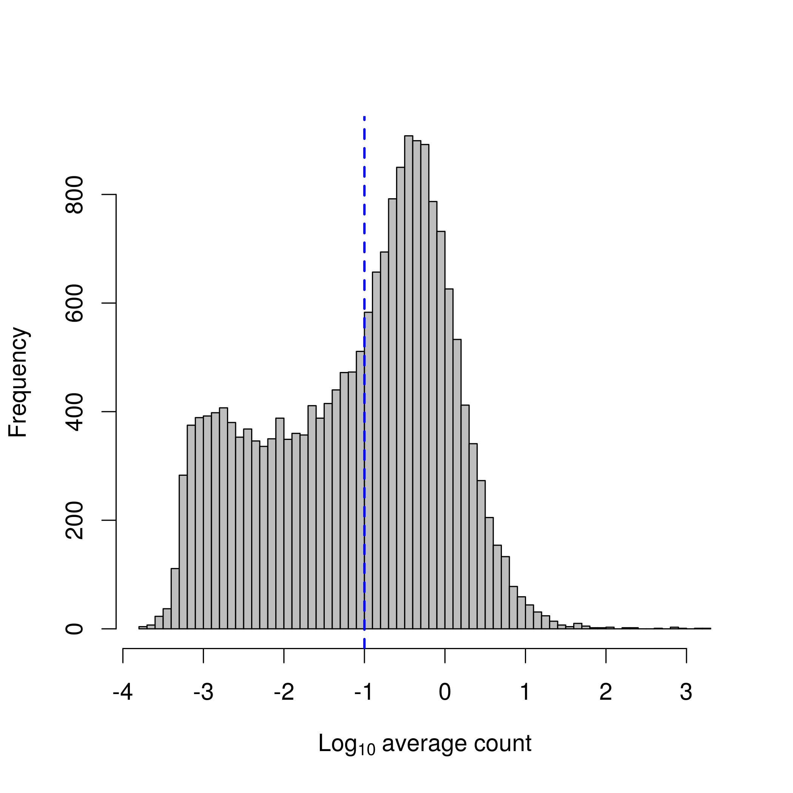
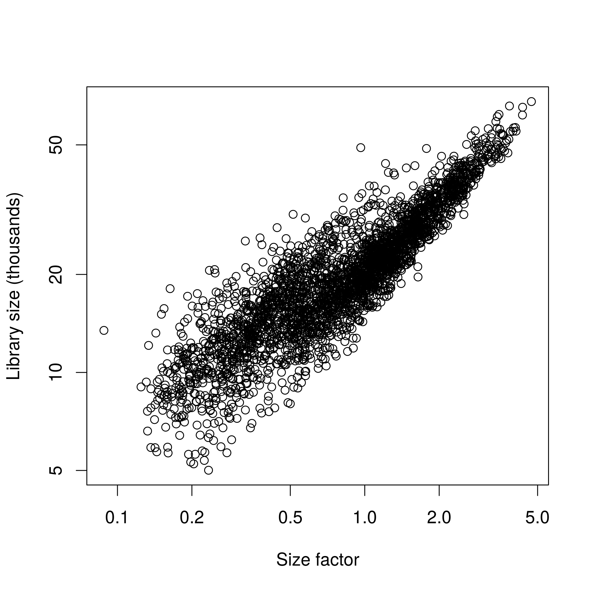

# Overview

In this article, we examine a heterogeneous dataset from a study of cell types in the mouse brain [@zeisel2015brain].
This contains approximately 3000 cells of varying types such as oligodendrocytes, microglia and neurons.
Individual cells were isolated using the Fluidigm C1 microfluidics system and library preparation was performed on each cell using a UMI-based protocol.
After sequencing, expression was quantified by counting the number of UMIs mapped to each gene.
Count data for all endogenous genes, mitochondrial genes and spike-in transcripts were obtained from http://linnarssonlab.org/cortex.

# Count loading 

The count data are distributed across several files, so some work is necessary to consolidate them into a single matrix.
We define a simple utility function for loading data in from each file. 
(We stress that this function is only relevant to the current dataset, and should not be used for other datasets.
This kind of effort is generally not required if all of the counts are in a single file and separated from the metadata.)


```r
readFormat <- function(infile) { 
    # First column is empty.
    metadata <- read.delim(infile, stringsAsFactors=FALSE, header=FALSE, nrow=10)[,-1] 
    rownames(metadata) <- metadata[,1]
    metadata <- metadata[,-1]
    metadata <- as.data.frame(t(metadata))

    # First column after row names is some useless filler.
    counts <- read.delim(infile, stringsAsFactors=FALSE, 
        header=FALSE, row.names=1, skip=11)[,-1] 
    counts <- as.matrix(counts)
    return(list(metadata=metadata, counts=counts))
}
```

Using this function, we read in the counts for the endogenous genes, ERCC spike-ins and mitochondrial genes.


```r
endo.data <- readFormat("expression_mRNA_17-Aug-2014.txt")
spike.data <- readFormat("expression_spikes_17-Aug-2014.txt")
mito.data <- readFormat("expression_mito_17-Aug-2014.txt")
```

We also need to rearrange the columns for the mitochondrial data, as the order is not consistent with the other files.


```r
m <- match(endo.data$metadata$cell_id, mito.data$metadata$cell_id)
mito.data$metadata <- mito.data$metadata[m,]
mito.data$counts <- mito.data$counts[,m]
```


In this particular data set, some genes are represented by multiple rows corresponding to alternative genomic locations.
We sum the counts for all rows corresponding to a single gene for ease of interpretation.


```r
raw.names <- sub("_loc[0-9]+$", "", rownames(endo.data$counts))
new.counts <- rowsum(endo.data$counts, group=raw.names, reorder=FALSE)
endo.data$counts <- new.counts
```

The counts are then combined into a single matrix for constructing a `SingleCellExperiment` object.
For convenience, metadata for all cells are stored in the same object for later access.


```r
library(SingleCellExperiment)
all.counts <- rbind(endo.data$counts, mito.data$counts, spike.data$counts)
sce <- SingleCellExperiment(list(counts=all.counts), colData=endo.data$metadata)
dim(sce)
```

```
## [1] 19896  3005
```

We add gene-based annotation identifying rows that correspond to each class of features.
We also determine the Ensembl identifier for each row.


```r
# Specifying the nature of each row.
nrows <- c(nrow(endo.data$counts), nrow(mito.data$counts), nrow(spike.data$counts))
is.spike <- rep(c(FALSE, FALSE, TRUE), nrows)
is.mito <- rep(c(FALSE, TRUE, FALSE), nrows)
isSpike(sce, "Spike") <- is.spike

# Adding Ensembl IDs.
library(org.Mm.eg.db)
ensembl <- mapIds(org.Mm.eg.db, keys=rownames(sce), keytype="SYMBOL", column="ENSEMBL")
rowData(sce)$ENSEMBL <- ensembl

sce
```

```
## class: SingleCellExperiment 
## dim: 19896 3005 
## metadata(0):
## assays(1): counts
## rownames(19896): Tspan12 Tshz1 ... ERCC-00170 ERCC-00171
## rowData names(1): ENSEMBL
## colnames(3005): V3 V4 ... V3006 V3007
## colData names(10): tissue group # ... level1class level2class
## reducedDimNames(0):
## spikeNames(1): Spike
```


# Quality control on the cells 

The original authors of the study have already removed low-quality cells prior to data publication.
Nonetheless, we compute some quality control metrics with *[scater](http://bioconductor.org/packages/scater)* to check whether the remaining cells are satisfactory.


```r
library(scater)
sce <- calculateQCMetrics(sce, feature_controls=list(Spike=is.spike, Mt=is.mito)) 
```

We examine the distribution of the QC metrics across all cells (Figure \@ref(fig:libplotbrain)).
The library sizes here are at least one order of magnitude lower than observed in the 416B dataset.
This is consistent with the use of UMI counts rather than read counts, as each transcript molecule can only produce one UMI count but can yield many reads after fragmentation.
In addition, the spike-in proportions are more variable than observed in the 416B dataset.
This may reflect a greater variability in the total amount of endogenous RNA per cell when many cell types are present.


```r
par(mfrow=c(2,2), mar=c(5.1, 4.1, 0.1, 0.1))
hist(sce$total_counts/1e3, xlab="Library sizes (thousands)", main="", 
    breaks=20, col="grey80", ylab="Number of cells")
hist(sce$total_features, xlab="Number of expressed genes", main="", 
    breaks=20, col="grey80", ylab="Number of cells")
hist(sce$pct_counts_Spike, xlab="ERCC proportion (%)",
    ylab="Number of cells", breaks=20, main="", col="grey80")
hist(sce$pct_counts_Mt, xlab="Mitochondrial proportion (%)", 
    ylab="Number of cells", breaks=20, main="", col="grey80")
```



We remove small outliers for the library size and the number of expressed features, and large outliers for the spike-in proportions.
Again, the presence of spike-in transcripts means that we do not have to use the mitochondrial proportions.


```r
libsize.drop <- isOutlier(sce$total_counts, nmads=3, type="lower", log=TRUE)
feature.drop <- isOutlier(sce$total_features, nmads=3, type="lower", log=TRUE)
spike.drop <- isOutlier(sce$pct_counts_Spike, nmads=3, type="higher")
```

Removal of low-quality cells is then performed by combining the filters for all of the metrics.
The vast majority of cells are retained, which suggests that the original quality control procedures were generally adequate.


```r
sce <- sce[,!(libsize.drop | feature.drop | spike.drop)]
data.frame(ByLibSize=sum(libsize.drop), ByFeature=sum(feature.drop), 
    BySpike=sum(spike.drop), Remaining=ncol(sce))
```

```
##   ByLibSize ByFeature BySpike Remaining
## 1         8         3       8      2989
```

We could improve our cell filtering procedure further by setting `batch` in `isOutlier` to one or more known factors, e.g., mouse/plate of origin.
As previously mentioned, this would avoid inflation of the MAD and improve power to remove low-quality cells.
However, for simplicity, we will not do this as quality control has already been performed by the original authors.


# Cell cycle classification

Application of `cyclone` to the brain dataset suggests that most of the cells are in G1 phase (Figure \@ref(fig:phaseplotbrain)).
This requires the use of the Ensembl identifiers to match up with the pre-defined classifier.


```r
library(scran)
mm.pairs <- readRDS(system.file("exdata", "mouse_cycle_markers.rds", package="scran"))
assignments <- cyclone(sce, mm.pairs, gene.names=rowData(sce)$ENSEMBL)
table(assignments$phase)
```

```
## 
##   G1  G2M    S 
## 2980    8    1
```

```r
plot(assignments$score$G1, assignments$score$G2M, xlab="G1 score", ylab="G2/M score", pch=16)
```



However, the intepretation of this result requires some caution due to differences between the training and test datasets.
The classifier was trained on C1 SMARTer data [@scialdone2015computational] and accounts for the biases in that protocol. 
The brain dataset uses UMI counts, which has a different set of biases, e.g., 3'-end coverage only, no length bias, no amplification noise.
Furthermore, many neuronal cell types are expected to lie in the G0 resting phase, which is distinct from the other phases of the cell cycle [@coller2006new].
`cyclone` will generally assign such cells to the closest known phase in the training set, which would be G1.


# Examining gene-level metrics

Figure \@ref(fig:topgenebrain) shows the most highly expressed genes across the cell population in the brain data set.
This is mostly occupied by spike-in transcripts, suggesting that too much spike-in RNA may be have been used.
There are also a number of constitutively expressed genes, as expected.


```r
fontsize <- theme(axis.text=element_text(size=12), axis.title=element_text(size=16))
plotQC(sce, type = "highest-expression", n=50) + fontsize
```


Gene abundance is quantified by computing the average count across all cells (Figure \@ref(fig:abhistbrain)).
As previously mentioned, the UMI count is generally lower than the read count.


```r
ave.counts <- calcAverage(sce)
hist(log10(ave.counts), breaks=100, main="", col="grey",
    xlab=expression(Log[10]~"average count"))
abline(v=log10(0.1), col="blue", lwd=2, lty=2)
```



We save the average counts into the `SingleCellExperiment` object for later use.
We also remove genes that have average counts of zero, as this means that they are not expressed in any cell.


```r
rowData(sce)$ave.count <- ave.counts
to.keep <- ave.counts > 0
sce <- sce[to.keep,]
summary(to.keep)
```

```
##    Mode   FALSE    TRUE 
## logical       2   19894
```


# Normalization of cell-specific biases

For endogenous genes, normalization is performed using the deconvolution method in the `computeSumFactors` function.
Here, we cluster similar cells together and normalize the cells in each cluster using the deconvolution method.
This improves normalization accuracy by reducing the number of DE genes between cells in the same cluster.
Scaling is then performed to ensure that size factors of cells in different clusters are comparable.


```r
high.ave <- rowData(sce)$ave.count >= 0.1
clusters <- quickCluster(sce, subset.row=high.ave, method="igraph")
sce <- computeSumFactors(sce, cluster=clusters, 
    subset.row=high.ave, min.mean=NULL)
summary(sizeFactors(sce))
```

```
##    Min. 1st Qu.  Median    Mean 3rd Qu.    Max. 
##  0.1257  0.4550  0.8149  1.0000  1.3435  4.4814
```

We set `subset.row` to use only the high-abundance genes for normalization (as well as clustering, for consistency).
We use a threshold of 0.1 to define `high.ave`, which is lower than the default threshold of `min.mean=1` in `computeSumFactors`.
This reflects the fact that UMI counts are generally smaller than read counts.
Setting `min.mean=NULL` simply avoids recomputing the average count within `computeSumFactors`, given that filtering has already been performed with `subset.row`.


Compared to the 416B analysis, more scatter is observed around the trend between the total count and size factor for each cell (Figure \@ref(fig:normplotbrain)).
This is consistent with an increased amount of DE between cells of different types, which compromises the accuracy of library size normalization [@robinson2010scaling].
In contrast, the size factors are estimated based on median ratios and are more robust to the presence of DE between cells.


```r
plot(sizeFactors(sce), sce$total_counts/1e3, log="xy",
    ylab="Library size (thousands)", xlab="Size factor")
```



We also compute size factors specific to the spike-in set, as previously described.


```r
sce <- computeSpikeFactors(sce, type="Spike", general.use=FALSE)
```

Finally, normalized log-expression values are computed for each endogenous gene or spike-in transcript using the appropriate size factors.


```r
sce <- normalize(sce)
```


__Comments from Aaron:__

- Only a rough clustering is required to avoid pooling together very different cell types in `computeSumFactors`.
The function is robust to a moderate level of differential expression between cells in the same cluster.
- `quickCluster` performs scale-invariant clustering by using distances based on Spearman's rank correlation.
This avoids circularity between clustering and normalization but is very coarse and not recommended for obtaining biologically relevant clusters.
- For large data sets, using `method="igraph"` in `quickCluster` will speed up clustering. 
This uses a graph-based clustering algorithm - see `?buildSNNGraph` for more details.

# Modelling and removing technical noise

We model the technical noise by fitting a mean-variance trend to the spike-in transcripts, as previously described.
There are a number of 


